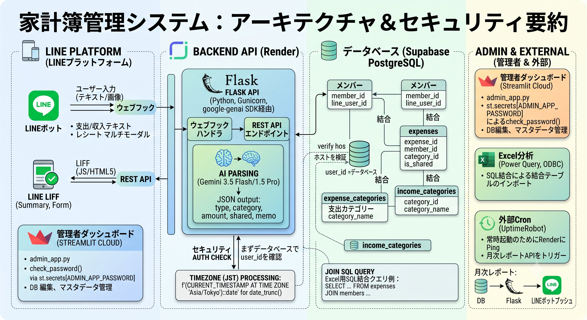

# 家計簿管理システム・技術仕様書
# 1. システム概要
本システムは、LINEをインターフェースとして日常の家計簿入力（AIによる自動解析含む）を行い、LIFF（LINE Front-end Framework）およびStreamlitベースの管理者ダッシュボードを通じて、支出の可視化・分析・管理を行う家計簿管理システムである。
# 2. 全体アーキテクチャ
システムは以下のマルチプラットフォーム構成で構築され、データの一元管理とセキュアなアクセス制御を実現している。

# 3. LINEプラットフォーム 
## 3-1. 公式LINE
[公式LINE](https://manager.line.biz/)を用いてLINE Botを使い、家計簿の登録・確認ができる。本公式LINEは管理者の個人LINEを紐づけて作成している。

公式LINEではリッチメニューを選択できる。また、ユーザーのテキスト入力にも対応する。

## 3-2. LIFF（LINE Front-end Framework）
公式LINEリッチメニューからHTMLウェブアプリを動作させる。[LINE Developer](https://developers.line.biz/console/)から**家計簿Bot用フォーム**をチェック。LIFF IDもここから確認でき、HTMLファイルで必要となる。HTMLファイルは`scripts/templates/liff.html`を参照。

## 3-3. Messaging API（LINE ⇔ Server）
[LINE Developer](https://developers.line.biz/console/) → 「家計ぼっとくん」 → Messaging APIに進む。Webhook URLにはLINEアプリで応答を決める際のURL (https://[LINEアプリのサーバーURL]/callback) を貼る。当URLは[Render](https://dashboard.render.com/)のFlaskサーバー上のものである。

## 3-4. 操作について（ユーザードキュメンテーション）
ここに、ユーザーのLINEプラットフォームの使い方を記す。

### 3-4-1. 認証
公式LINE追加後、認証を行うまでは機能が一切使えず、データベースにもアクセスできないようになっている。
認証はメッセージで合言葉を送信すればよく、この合言葉は[Render](https://dashboard.render.com/) → Environment → Environment Variables から確認できる。

認証後はデータベースの`members`に登録され、以後機能が解放される。

### 3-4-2. リッチメニュー・「家計簿」
リッチメニュー欄の「家計簿」を押すと`liff.html`で示したとおりのウェブアプリが開く。
- 「支出」から支出タプルを挿入できる。区分を個人用と共有用で分けることが可能である。
- 「収入」から収入タプルを挿入できる
- 「履歴」から日付の新しい順に自分が入力した収支タプルの確認ができる。削除も可能である。
- 「概要」から過去30日間の概要をチェックできる。自分の総支出と、共有支出における自身の負担割合が確認できる。

### 3-4-3. リッチメニュー・「管理者サイト」
管理者サイトのURLが表示される。管理者サイトの詳細は以下に記す。

### 3-4-4. メッセージによるAIパース
メッセージで家計簿登録をしようと試みるとAIが判定してメッセージを返す。
正しく認識できていれば「確定」を押すとその通りにデータベースに登録される。
「キャンセル」を押すと登録は行われない。\
（メッセージ例: 「昨日、スーパーで2000円、共有で」）

### 3-4-5. 月次サマリー
毎月1日の午前9時になると、先月の総括が自動的に送られる。認証されていないユーザーには送信されない。

# 4. Render・Flaskサーバー
LINE上で動作するアプリを動かすサーバーである。
[Render](https://dashboard.render.com/)は管理者の個人用[GitHub](https://github.com/)アカウントと紐づいている。

## 4-1. Settings
Render → Settings から確認できる項目は次の通りである。
- Build 欄から、本プロジェクトが指定されていることが確認できる。
本プロジェクトにコミットが発生すると、自動的に更新され、数分後に再ビルド、デプロイされる。
- General 欄にサーバーの所在地を指定する。ここではシンガポールを選択している。日本から最も近いサーバーである。
- Deploy 欄にデプロイのコマンドが書かれている。本プロジェクトのProcfile（拡張子なし）にもその内容が書かれているが、`scripts/app.py`を起動せよという意味を表す。

## 4-2. Logs
Render → Logs からログが確認できる。デバッグに便利となる。

## 4-3. Environment
Render → Environment から環境変数を定義できる。必要なものは以下の通りである。**これは流出しないよう注意すること！**
- ADMIN_APP_URL: 管理者サイトのURL。
- APP_PASSWORD: LINE認証の際のパスワード。
- GEMINI_API_KEY: LINEメッセージの自動パース用にGeminiを用いる。
- LINE_CHANNEL_ACCESS_TOKEN: LINE Messaging APIに必要である。
- LINE_CHANNEL_SECRET: LINE Messaging APIに必要である。
- SUPABASE_URI: データベースにアクセスするためのものである。通信方法は「Session Pooler」を使用。

# 5. 管理者サイト・家計簿管理システム
Webサイトで全体の確認ができるようになっている。
LINE上では自分以外のトランザクションに関してみることはできないが、このサイトでは全てのデータにアクセスできる。
[Streamlit](https://share.streamlit.io/)を用いて作成したWebアプリである。
個人用GitHubアカウントと紐づけてデプロイしており、コミットがあると自動で再度デプロイされる。

## 5-1. システム作成時の注意
アプリ作成時にRepository欄から本リポジトリを選択している。
Advanced SettingsのPython versionを3.12に、secretsに以下の内容を加えている。
- SUPABASE_URI = "(RenderにおけるEnvironmentと同じ。Session Poolerを使用)"
- ADMIN_APP_PASSWORD = "(ログイン時のパスワード)"

Pythonのバージョンを最新（2026年8月時点で3.14）にするとバージョン整合の関係からエラーが出たので少し古いものを選択した。

## 5-2. システムのセキュリティ
本システムにアクセスする際にはパスワードが必要となる。

Streamlitの設定で公開設定をPublicにするかしないかを決定できる。アプリを開いて、右上の「Share」欄から確認できる。
Publicにすると、誰でもアクセスできるようになるためパスワードは必須である。Publicにしない場合、個人用GitHubアカウントにサインインする必要がある。

## 5-3 操作について（ユーザードキュメンテーション）
ここに、管理者システムの使い方を記す。

まずはログインが必要である。ログイン後には以下の操作ができる。
- 「データ一覧・修正・削除」からデータの修正、および削除が可能である。
- 「データ一覧・修正・削除」からデータの確認ができる。その際に絞り込み機能を使うことができる。
- 「データ手動追加」から新しいデータを追加できる。
- 「カテゴリーマスター管理」から項目の管理ができる。

項目管理では新しい項目の追加や項目名の変更ができる。
また、項目の表示/非表示を切り替えられる。
これはデータ追加の際に、項目名を選択欄の中に表示するかどうかを決めるものである。

さらに、項目を削除することも可能である。これはデータベースの保守性を鑑みると行うべきではなく、**非表示にとどめることを推奨する**。
削除も可能ではあるが、既存のデータにその項目が含まれている場合は全て「その他」に割り振られる。
また、このことから項目「その他」を削除することはできない。

# 6. データベースについて
データベースは[Supabase](https://supabase.com/dashboard/org)を用いてクラウドで管理している。
Supabaseも個人用GitHubと紐づけている。
ローカルにないため保守性は高いといえる。

## 6-1. スキーマについて
データベースのスキーマは以下の通りである。下線を引いたものがキーとなる。
- expenses(<u>expense_id</u>, date, member_id, category_id, amount, memo, is_shared)

支出テーブルである。dateはdate型、memoはtext型とし、他はint4型である。
is_sharedは1なら共有用、0なら個人用を指す。
- incomes(<u>income_id</u>, date, member_id, category_id, amount, memo)

収入テーブルである。dateはdate型、memoはtext型とし、他はint4型である。
- members(<u>member_id</u>, member_name, line_user_id)

メンバーテーブルである。member_idはint4型、他はtext型である。
LINE認証を行うとここに追加される。
- expense_categories(<u>category_id</u>, category_name, is_active)

支出項目テーブルである。category_nameはtext型とし、他はint4型である。
is_activeは1なら表示、0なら非表示を指す。
- income_categories(<u>category_id</u>, category_name, is_active)

収入項目テーブルである。category_nameはtext型とし、他はint4型である。
is_activeは1なら表示、0なら非表示を指す。

## 6-2. スキーマの変更について
[Supabase](https://supabase.com/dashboard/org)の左側のメニューからSQL Editorを選択し、SQL文を書く。
更新がある場合はここで実行する。

## 6-3. データベースへのアクセスについて
[Supabase](https://supabase.com/dashboard/org)の上側のConnect → Direct からアクセス方法を調べることができる。
Direct connectionはIPv6を使ったアクセスで、試してみたところうまくいかなかったので、Session Poolerを用いている。
いずれにしてもConnection stringを見て、他のモジュールにこの文字列を打つとアクセスできるようになる。

Connection stringはSession Poolerの場合、以下のような構造になっている。\
`postgresql://postgres.[USER_NAME]:[PASSWORD]@[SERVER_NAME]:[PORT_NUMBER]/postgres`

# 7. cronjobについて
[cronjob](https://console.cron-job.org/jobs)を用いて、サーバーへ適切なタイミングで信号を送る。
cronjobには個人用のGoogleアカウントからログインできる。

## 7-1. サーバーを起こすPing
LINEアプリが作動するRenderのサーバーは無料版だと15分に一度スリープモードになる。
そのため、14分に一回サーバーを起こすための空の通信を行う。
具体的には毎時0分、14分、28分、42分、56分に`https://[RenderのURL]/`と送る。

`scripts/app.py`の`index`メソッドが呼び出され、仮の文字列`'Render is awake!'`だけ返す。
これによりサーバーがスリープモードに入らなくなり、LINEアプリの応対が遅くならない。

ちなみに、Renderのサーバーは無料版では1か月あたり750時間まで使えるため、常に起こすと
24 * 30 = 720時間となり、ぎりぎり足りる。

## 7-2. 月次サマリー用のアクセス
LINEアプリでは毎月1日9時に、先月のサマリーが送られてくる。
この送信を起こす元がcronjobで作られている。
送る信号は`https://[RenderのURL]/api/send_monthly_report?key=[LINE認証用パスワード]`である。

# 8. Google AI Studioについて
Geminiを使って、LINEメッセージに対応するようにできている。[Google AI Studio](https://aistudio.google.com/)にアクセスし、Dashboardを選択。
GeminiのAPIキーを取得できる。

## 8-1. 使用モデル
さまざまなモデルを試してみたが、`gemini-3.5-flash`しかうまくいかなかった。
やや返答が遅いのでもう少し軽いモデルが使えないか確かめたい。

## 8-2. 利用上限について
無料枠は上限1500件/月である。これを超えると応答しなくなるはずだが、支払方法を設定していないので仮に超えても安心。

# 9. エクセルでの管理について
個人用OneDriveにエクセルファイルがあり、ここからデータベースへアクセスできるようになっている。
他のPCで使用するにはまずODBCのインストールが必要である。

「集計」シートの「データの更新」を押すとマクロが動き、DBにアクセスして最新のデータを取り出すことができる。

## 9-1. ODBCのインストールとDBへのアクセス
ExcelからSupabase（PostgreSQL）のデータベースに接続し、データを取得するためには、PCにODBCドライバをインストールし、接続設定を行う必要がある。

### 9-1-1. ODBCドライバのインストール
ドライバのダウンロード: PostgreSQLの公式ODBCドライバ「psqlODBC」をダウンロードする。[公式ダウンロードページ](https://odbc.postgresql.org/)等から、使用しているWindowsとExcelのビット数（通常は64bit）に合わせたmsiインストーラ（例: psqlodbc_xxxx-x64.zip）を取得する。インストーラを実行して標準設定のままインストールを完了させる。

### 9-1-2. ODBCデータソース（DSN）の設定
Windowsのスタートメニューから「ODBC データソース (64 ビット)」を検索して開く。
「ユーザー DSN」または「システム DSN」タブを開き、「追加」をクリックする。
ドライバ一覧から「PostgreSQL Unicode」を選択し、「完了」を押す。
SupabaseのConnection string（Session Pooler）の情報を元に、以下のセットアップ画面を入力する。
- Data Source: [DB_NAME]（例: HouseKeep_DB）
- Database: postgres
- Server: [SERVER_NAME] (例: aws-0-ap-northeast-1.pooler.supabase.com)
- Port: [PORT_NUMBER] (例: 5432)
- User Name: postgres.[USER_NAME]
- Password: [PASSWORD]

「Test」ボタンを押し、「Connection successful」と表示されれば設定完了。「Save」を押して閉じる。

### 9-1-3. ExcelでのDB読み込みと結合クエリの作成
ExcelのPower Query機能を利用して、ODBC経由でDBを読み込み、IDで分かれているテーブル（明細、メンバー、カテゴリー）を結合して扱いやすい形にする。
1. データ取得: Excelを開き、「データ」タブ → 「データの取得」 → 「その他のデータソースから」 → 「ODBC から」を選択。
2. データソース選択: 先ほど作成したDSNをドロップダウンから選択し、「OK」を押す。
3. データの読み込み: 「読み込み先」を押すと、Excelのシート上にテーブルとして出力される。これを全てのテーブルについて行う。
4. 結合: 「データ」タブ → 「データの取得」 → 「クエリの結合」 → 「マージ」を選択して、テーブルのマージを行う。
5. ピボットテーブル: 結合したテーブルを選択して「挿入」タブ → 「ピボットテーブル」からピボットテーブルを作成する。

## 9-2. 各シートについて
- 集計: 全体から支出、収入を管理できる。条件を指定して絞り込みできる。「データの更新」ボタンがある。
- 支出: 支出をテーブルとして扱う。絞り込みや並び替えができる。
- 収入: 収入をテーブルとして扱う。絞り込みや並び替えができる。
- expenses_raw（非表示）: expensesテーブルの生データ
- incomes_raw（非表示）: incomesテーブルの生データ
- expense_category_raw（非表示）: expense_categoryテーブルの生データ
- income_category_raw（非表示）: income_categoryテーブルの生データ
- members_raw（非表示）: membersテーブルの生データ

# 10. ファイル構成
本プロジェクトのファイル構成は以下の通りである。
- scripts
    - templates
        - liff.html: LINEアプリのLIFFで表示するWebアプリ
    - admin_app.py: 管理システムアプリ
    - app.py: LINE上のアプリ
    - db_manager.py: DBに対する処理をまとめたモジュール
- requirements.txt: 管理システムのデプロイ時に必要なパッケージ
- Procfile: LINEアプリのデプロイ用(app.pyを場所を示す)

# 11. 修正点・拡張点
以下に、修正すべき点と拡張を検討している点を書いておく。\
修正点
- Geminiの返答が遅い。OpenAIを使う手もある。十分安いものの無料枠はない。

拡張点
- レシート入力。VLMを用いて自動翻訳できないか考えている。